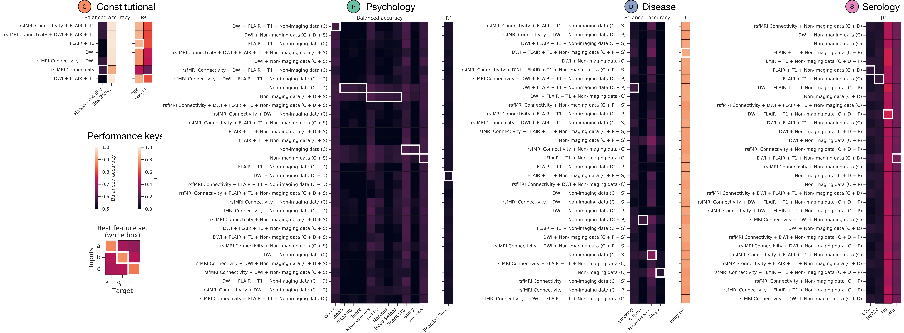
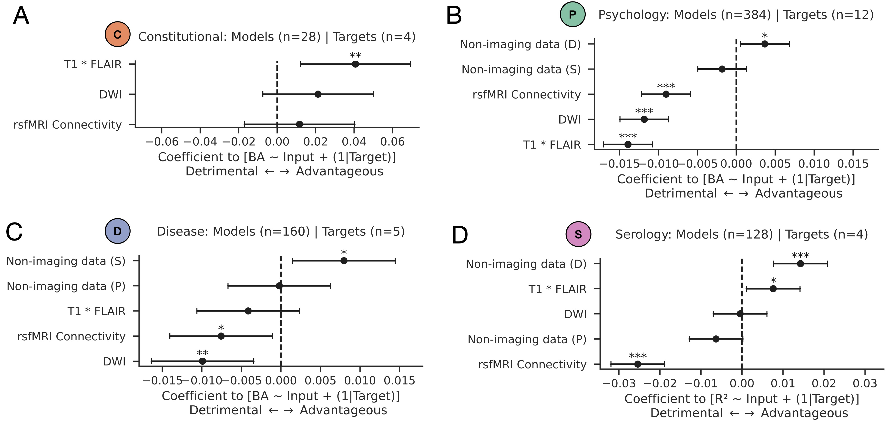
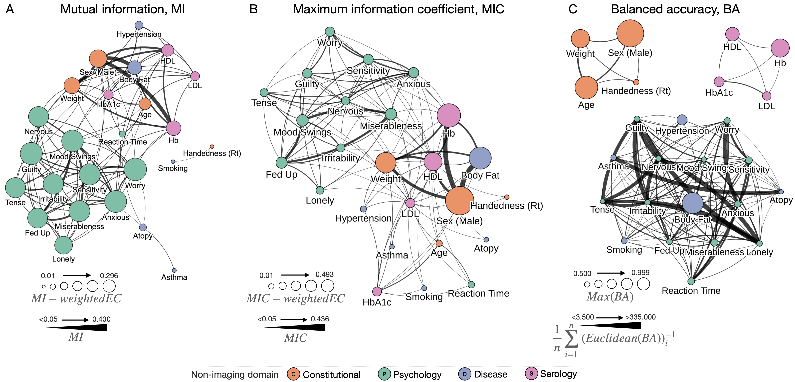
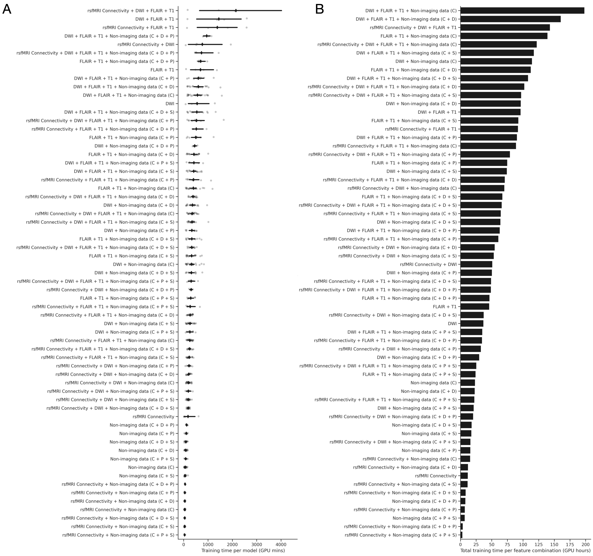

# [Computational limits to the legibility of the human brain](https://doi.org/10.1016/j.neuroimage.2024.120600)
# Article codebase

Software © Dr James K Ruffle | j.ruffle@ucl.ac.uk

High-Dimensional Neurology, UCL Queen Square Institute of Neurology


## Table of Contents
- [Headline numbers](#headline-numbers)
- [What is this repository for?](#what-is-this-repository-for)
- [Usage](#usage)
	- [Pre-trained models](#pre-trained-models)
	- [To retrain](#to-retrain)
- [Usage queries](#usage-queries)
- [Citation](#citation)
- [Funding](#funding)


## Headline numbers
- Models trained, validated, and tested across **23 810 unique UK Biobank participants**.
- **700 individual models** trained, offering flexibility in data availability spanning volumetric T1, FLAIR, DWI, resting functional connectivity, and non-imaging data (constitutional, psychological, serological, and disease).
- **4526 P100 GPU hours**
- **State-of-the-art sex classification: balanced accuracy on held-out test set 99.7%** (*using T1+FLAIR+DWI*)
- **State-of-the-art age prediction: mean absolute error on held-out test set 2.048 years** (*using T1+FLAIR*)


**Workflow.** A) Data selection and partitioning. B) Mean T1-weighted, FLAIR, DWI images, and rsfMRI connectivity matrix across the full cohort of 23 810 participants. C) Layered, nested, generative stochastic block model of modelling targets, with edges depicting the strength of interconnection by mutual information. Node size is proportional to eigenvector centrality, a measure of node ‘influence’ across its network. D) Algorithmic approach for exploring the model target-feature space to distinguish targets that can be reliably predicted from those that cannot, across all possible data inputs. Shown here is also a schematic of the possible data to train with, ranging from non-imaging data across the constitutional (C) – orange, disease (D) – blue, psychology (P) – green, and serology (S) – pink feature domains; and T1/FLAIR volumetric structural imaging; DWI volumetric imaging; and rsfMRI connectivity. These data are passed to individual trainable model blocks: a fully-connected feed-forward network (FNN) for both non-imaging data, and rsfMRI connectivity, and a 3D convolutional neural network (CNN) for T1/FLAIR and/or DWI. Model block dense layers are then concatenated and passed to a final FNN for output prediction.


## What is this repository for?
This is the codebase for the article: [Computational limits to the legibility of the human brain](https://doi.org/10.1016/j.neuroimage.2024.120600).

Harmonising *large scale multichannel neuroimaging data*, *high-performance hardware*, and a custom-built *general purpose deep learning training pipeline*, we quantify the **individual-level legibility of common biological and pathological characteristics from models of the structurally and functionally imaged human brain**. 

**The process illuminates what can — and what plausibly cannot be — predicted from current neuroimaging with large-scale data and state-of-the-art deep learning architectures.**



**Model performances.** A) Test set performance for all models across the constitutional (C) – orange, disease (D) – blue, psychology (P) – green, and serology (S) – pink feature domains. Index of performance is given as balanced accuracy for classification targets and R<sup>2</sup> for regression fits. The x-axis of all heatmaps depicts the model target, and y-axis depicts the range of feature inputs. White boxes demarcate the best set of inputs to achieve the greatest out-of-sample model performance.



**Domain-specific effects.** Linear mixed-effects models for predicting out of sample performance (balanced accuracy or R2, where applicable) from structural imaging, functional imaging, and non-imaging domain feature sets. Shown are coefficient plots for models whose targets are A) constitutional, B) psychology, C) disease, and D) serology. Inputs with coefficients whose values are positive are associated with increase model performance (advantageous), whilst features with negative coefficients are associated with weaker performance (detrimental). Asterisks stipulate statistical significance as per standard convention: * denotes p<0.05; ** denotes p<0.01; *** denotes p<0.001.


## Usage
### Pre-trained models
1) Open the [HTML dashboard](Interactive_results.html) in your web browser. 
2) Navigate to the target of choice.
	- Hovering over the target will show the best performing model with the input data required.
	- Clicking the target will provide a dropdown of all model performances, in detail.
    - **Important**: all models are trained on lightly pre-processed data from the UK Biobank neuroimaging team, as detailed in this [article](https://doi.org/10.1016/j.neuroimage.2017.10.034). Images have undergone brain-extraction, with additional signal intensity clamping and resampling to 128<sup>3</sup>. Data is available from the UK Biobank team [here](https://www.ukbiobank.ac.uk). Our image extraction, re-sizing, and standardisation pipeline is available [here](code/import_FLAIR_T1_seg_triples_biobank_3D.m). Please contact us if further information is required on reproducing our specific pre-processing pipeline.

N.B. A detailed breakdown of all model performances is available as a [csv file here](assets/metrics_comparison_test.csv).


**Visual network analysis plots of feature relationships and model performances.** A) Graph of target features, with nodes sized by mutual information (MI)-weighted eigenvector centrality (EC), and edges sized according to pairwise MI. Eigenvector centrality is a measure of influence of a node across a network. B) Graph of target features, with nodes sized by the maximum information coefficient (MIC)-weighted eigenvector centrality (EC), and edges sized according to the MIC. C) Graph of target features, with nodes sized by the maximum balanced accuracy across all models (BA), with edges sized according to the mean inverse Euclidean distance of all input combinations between each pair of targets. For all panels we depict the top 60% of edges for visualisation purposes. Note that all graphs are made available as fully interactive and customizable [HTML objects here](Interactive_results.html), and within the [article supplementary material](https://doi.org/10.1016/j.neuroimage.2024.120600) 


### To retrain
You can **retrain** a model using this [Python code](code/train.py).
- There may be dependencies you need to install (included but not limited to [PyTorch](https://pytorch.org), [monai](https://monai.io), [sklearn](https://scikit-learn.org/stable/), [nibabel](https://nipy.org/nibabel/)). Please review the code imports for this within the file.
- A docker container with all prerequisite package installations has been made available on [Docker Hub](https://hub.docker.com/r/highdimneuro/biobank_megamodeller). This can be pulled with the following command:
```docker pull highdimneuro/biobank_megamodeller```

There are numerous optional arguments with [train.py](code/train.py).

Calling ```python train.py -h``` will return the following:

```
optional arguments:
  -h, --help            show this help message and exit
  --target TARGET       the variable to be predicted, default = "sex"
  --inputs INPUTS [INPUTS ...]
                        the data to be trained with, default = ["flair", "t1", "dwi", "metadata", "connectivity"]
  --metadata_blocks METADATA_BLOCKS [METADATA_BLOCKS ...]
                        the metadata blocks to be passed with, default = ["constitutional","serology","psychology","disease"]
  --device DEVICE       gpu card access, default = "cuda:0"
  --inpath INPATH       the data path which contains the imaging, metadata and connectivity. It should contain the subdirectories of TEST and TRAIN, with subsequent directory cascades of T1, FLAIR, DWI, etc., default = "/data/BIOBANK/"
  --outpath OUTPATH     the data path for writing results to, default = "/data/BIOBANK/results_out/"
  --epochs EPOCHS       the number of epochs to train for, default = 999999
  --restore RESTORE     whether you are continuing a halted training loop, default=False
  --batch_size BATCH_SIZE
                        model batch size, default=64
  --num_workers NUM_WORKERS
                        number of multiprocessing workers, default=18
  --resize RESIZE       Whether to resize the imaging, if passed as True shall work in 64 cubed, rather than the default 128, default=yes
  --veto_transformations VETO_TRANSFORMATIONS
                        Whether to prevent use of image transformations on the fly, default=yes since we have pre-computed them for speedup
  --augs_probability AUGS_PROBABILITY
                        probability of augmentation application, default=0.05
  --diagnostic DIAGNOSTIC
                        Whether to enable diagnostic mode, which re-encodes all input data as 1 and 0, for debugging purposes, default=no
  --data_size DATA_SIZE
                        Whether to reduce the size of the data for training, for debugging purposes, default = 999999999
  --multi_gpu MULTI_GPU
                        Whether to enable,default=no
  --n_gpus N_GPUS       Number of GPUs to permit,default=4
  --lr LR               Learning rate,defauly=0.0001
  --patience PATIENCE   Model patience,default=30
  --cache_val_set CACHE_VAL_SET
                        whether to cache load the val dataset, default=yes
  --hello_world         hello world introduction
```

*Example training call, training a sex classifier with T1+FLAIR+DWI, with otherwise default parameters:*
```python train.py --target sex --inputs flair t1 dwi```

N.B. You **do not** need to pass all input data. The model will recognise the inputs you provide it, zero those non-supplied entities, and remove this from the back-propagation operation. In the example call above, rsfMRI connectivity and non-imaging data will all be zeroed, and held out from back-propagation.


Code for all model training and post-hoc analysis detailed within the [article](https://doi.org/10.1016/j.neuroimage.2024.120600) is open sourced [here](code/). 

Model architecture is available [here](assets/architecture.svg).


**Anticipated training times (benchmarks on 4 x P100 GPUs)**, A) Strip plot illustrates training time taken per model in GPU minutes (x-axis) for all possible feature input combinations (y-axis). Grey points indicate individual models, with mean shown as a black diamond, and 95% confidence interval shown as a black line. B) Bar plot of total training time in GPU hours for all feature input combinations. Only 64 x 64 x 64 resolution models are shown here for visual simplicity. 


## Usage queries
Via github issue log or email to j.ruffle@ucl.ac.uk.


## Citation
If using or referencing these works, please cite the following [article](https://doi.org/10.1016/j.neuroimage.2024.120600).

James K Ruffle, Robert Gray, Samia Mohinta, Guilherme Pombo, Chaitanya Kaul, Harpreet Hyare, Geraint Rees, Parashkev Nachev. Computational limits to the legibility of the human brain. Neuroimage. 2024. DOI: https://doi.org/10.1016/j.neuroimage.2024.120600


## Funding
The Wellcome Trust; Medical Research Council; UCLH NIHR Biomedical Research Centre; Guarantors of Brain; NHS Topol Digital Fellowship.


