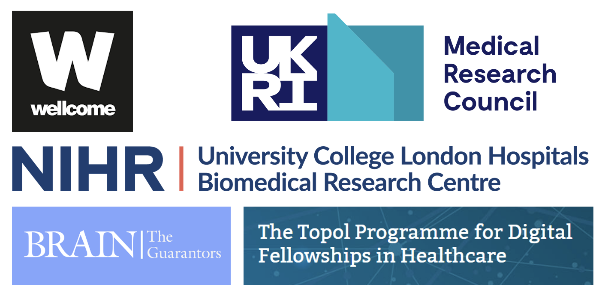

# The Biobank Megamodeller
# Codebase for the article 'The legibility of the human brain' 

**Please note this software is in beta, will likely undergo significant further refinement, and may even contain bugs.**

Software © Dr James K Ruffle | j.ruffle@ucl.ac.uk | High-Dimensional Neurology, UCL Queen Square Institute of Neurology

**Image key:** Text text text

## Table of Contents
- [What is this repository for?](#what-is-this-repository-for)
- [Usage](#usage)
- [Citation](#citation)
- [Funding](#funding)

## What is this repository for?
We quantify the individual-level legibility of common biological and pathological characteristics from models of the structurally and functionally imaged human brain. The process illuminates what can—and what plausibly cannot be—predicted from current neuroimaging with large-scale data and state-of-the-art deep learning architectures. More informative imaging and/or more powerful models will likely be needed to decipher individual-level biological and common pathological characteristics in the human brain. We make all models and code openly available. 

## Usage
1. Text text text

	

	

## Usage queries
Via github issue log or email to j.ruffle@ucl.ac.uk

## Citation
If using these works, please cite the following [paper](https://arxiv.org/abs/X):

James K Ruffle, Robert Gray, Samia Mohinta, Guilherme Pombo, Chaitanya Kaul, Harpreet Hyare, Geraint Rees, Parashkev Nachev. The legibility of the human brain. ArXiv. 2023. DOI X

## Funding
The Wellcome Trust; UCLH NIHR Biomedical Research Centre; Medical Research Council; Guarantors of Brain; NHS Topol Digital Fellowship.

